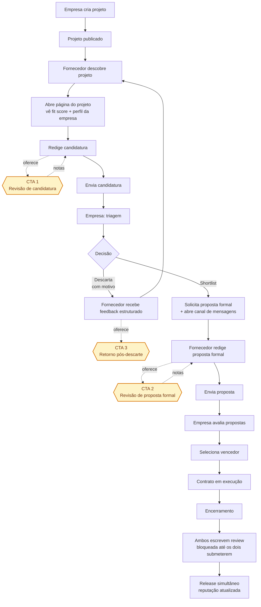

# Handshake Flow — ConectaFornece

> Design artifact. Describes how an empresa and a fornecedor meet, shake hands, and close a contract on the platform, and where Celso's consulting team plugs into that flow.

## Propósito

Desenhar o fluxo ponta-a-ponta entre empresa e fornecedor, do momento em que o projeto é publicado até o fechamento do contrato e a liberação das avaliações, marcando os pontos em que a Consultoria (Celso + equipe) se oferece.

O fluxo é uma **negociação de três etapas** — candidatura leve, pré-seleção pela empresa, proposta formal — espelhando como procurement industrial realmente funciona, e criando dois momentos naturais para a Consultoria agregar valor.

## Atores

| Ator | Papel |
| --- | --- |
| **Empresa** | Publica o projeto, faz triagem de candidaturas, seleciona shortlist, recebe e avalia propostas formais, fecha contrato. |
| **Fornecedor** | Descobre o projeto, envia candidatura, pode ser shortlisted, submete proposta formal se selecionado. |
| **Consultoria** (Celso + equipe) | Oferece revisão de candidatura, revisão de proposta formal, e retorno pós-descarte. Ponto de monetização da plataforma. |

## Diagrama

## Fase a fase

### Fase 0 — Descoberta

- **Empresa** cria um projeto com escopo, categoria, região, cidade, faixa de orçamento, prazo, requisitos técnicos, credenciais exigidas, documentos exigidos e critérios de seleção.
- Projeto entra no feed público. Fornecedores filtram por categoria, região/cidade, faixa de valor, prazo.
- **Fornecedor** abre a página do projeto. Vê:
  - Descrição completa do escopo
  - Perfil da empresa (reputação agregada, histórico de contratos encerrados, tempo médio de pagamento, avaliações recebidas)
  - **Fit score** — indicador leve baseado em match de categoria, região, capacidade declarada. Grátis, com um hook sutil ("quer entender por que seu score é 72?")

Não há compromisso nesta fase. O fornecedor pode navegar livremente.

### Fase 1 — Candidatura

**Candidatura ≠ proposta formal.** É uma manifestação estruturada e leve, curta o bastante para não desencorajar mas rica o bastante para a empresa triar.

Campos da candidatura:

- Pitch curto (livre, ~500 caracteres) — por que sou bom para este projeto
- Contratos relevantes já executados (seleção a partir do perfil; o fornecedor destaca 2–3)
- Capacidade/disponibilidade declarada
- Faixa de preço preliminar (opcional — protege quem não quer revelar cedo)
- Documentos exigidos pelo projeto, com match contra os comprovantes do perfil

Regras da seção documental:

- Se um `documento_exigido` estiver ligado a uma `credencial_exigida`, a UI tenta localizar um comprovante vigente correspondente em `Fornecedor.documentos_empresa`.
- Se encontrar, mostra `Anexar do perfil` e reutiliza o mesmo `arquivo_caminho`.
- Se a credencial existir mas faltar comprovante, mostra pendência forte (`credencial cadastrada, mas sem comprovante`).
- Se não houver correspondência automática, o fornecedor pode `Anexar manualmente`.
- Anexo manual continua sendo **metadata-only** no mock, mas salva também no perfil do fornecedor para reaproveitamento futuro.
- **Não bloquear envio**: documentos obrigatórios pendentes geram alerta, mas o botão `Enviar candidatura` continua habilitado quando os campos básicos estiverem válidos.

Ao lado do botão **Enviar candidatura**, aparece a **CTA 1**: _"Quer um especialista da Consultoria revisando antes?"_ — não é um paywall, é um serviço ao lado. Ver seção Consultoria.

### Fase 2 — Pré-seleção (empresa-driven)

A empresa recebe as candidaturas em uma tela de triagem. Cada candidatura vira um cartão com:

- Pitch curto
- Fit score
- Contratos relevantes destacados
- Reputação agregada do fornecedor
- Capacidade e faixa de preço declarada

Ações da empresa em cada candidatura:

- **Incluir na shortlist** (típico: 3–5) → dispara solicitação de proposta formal + abre canal de mensagens para dúvidas
- **Descartar com motivo** (categorias fixas: fora de escopo, sem capacidade, preço fora, documentação, outro) → fornecedor recebe notificação com a categoria de motivo

O descarte estruturado é crítico — ele alimenta tanto o feedback ao fornecedor quanto a inteligência que a Consultoria usa para ofertas proativas.

### Fase 3 — Proposta formal (apenas shortlisted)

Agora o documento pesado: escopo detalhado, cronograma, preço final, documentos, anexos técnicos. É aqui que o fluxo de fechamento de contrato já existente se conecta.

Ao lado do botão **Enviar proposta**, aparece a **CTA 2** — revisão de proposta formal. Ticket maior que a CTA 1, pode ser precificada como success-fee.

A empresa avalia as propostas formais lado-a-lado, seleciona o vencedor, e o contrato é fechado usando o fluxo de encerramento já implementado.

### Fase 4 — Execução e reviews

- Contrato em execução (status já existe no mockup).
- Ao ser marcado como **encerrado**, ambas as partes ganham acesso a um formulário de review.
- **Nenhuma review é visível até que as duas sejam submetidas** (ou até que um prazo expire — ex.: 14 dias). Isso é o "Airbnb guard" contra retaliação.
- Release simultâneo → reputação agregada de ambos os perfis é recalculada.

## Pontos de inserção da Consultoria

| CTA | Onde aparece | Serviço | Ticket sugerido |
| --- | --- | --- | --- |
| **CTA 1 — Revisão de candidatura** | Ao lado do botão "Enviar candidatura" (Fase 1). Secundário: pode aparecer no topo da página do projeto. | Leitura da candidatura + projeto + perfil da empresa. Retorna notas em até 24–48h. | Baixo (entrada). Volume alto. |
| **CTA 2 — Revisão de proposta formal** | Ao lado do botão "Enviar proposta" (Fase 3). | Leitura profunda da proposta. Possível pacote success-fee contingente à vitória. | Médio-alto. Volume menor, conversão maior. |
| **CTA 3 — Retorno pós-descarte** | Na notificação de descarte (Fase 2). Pode ser proativa (admin da Consultoria identifica fornecedores com muitos descartes na mesma categoria). | Sessão diagnóstica — por que as candidaturas não passam, como reposicionar narrativa. | Médio. Reativo/proativo. |

Nenhuma CTA bloqueia o fluxo. O fornecedor consegue completar as 4 fases sem pagar nada.

## Mecânica de reviews

| Dimensão | Empresa avalia fornecedor | Fornecedor avalia empresa |
| --- | --- | --- |
| Execução / qualidade técnica | ✓ | — |
| Cumprimento de prazo | ✓ | ✓ (prazo de decisão / cronograma) |
| Comunicação | ✓ | ✓ |
| Segurança | ✓ | — |
| Pagamento | — | ✓ |
| Clareza de escopo | — | ✓ |
| Relacionamento geral | ✓ | ✓ |

Regras:

- Reviews só desbloqueiam após contrato encerrado.
- Autor individual (membro) visível no review; nota agrega no perfil da organização.
- Release simultâneo (ambos submetem cego, ambos são revelados juntos).
- Prazo máximo de 14 dias após encerramento para submeter; depois disso, a review do lado que submeteu é publicada unilateralmente.

## Decisões (confirmadas com Arthur, 2026-04-14)

1. **Candidatura editável após envio** — sim, enquanto status = "aguardando triagem". Congela quando vai para shortlist ou descarte. Permite iterar com a Consultoria após CTA 1 sem retrabalho.
2. **Limite de candidaturas simultâneas** — sem limite duro. Soft warning ao passar de ~10 abertas: "você tem muitas candidaturas, foque nas melhores". Respeita autonomia, sinaliza dispersão.
3. **Visibilidade da shortlist** — opaca durante, transparente após. Fornecedor sabe apenas o próprio status; após o fechamento, mostra vencedor + nº total de candidatos. Material para estudos de caso da Consultoria.
4. **Faixa de preço na candidatura** — opcional, com nudge. UI sinaliza que candidaturas com preço têm mais chance de avançar. Protege quem não quer abrir cedo, sem perder o sinal.
5. **Mensagens na shortlist** — híbrido. Chat livre + templates de pergunta estruturada ("tem disponibilidade para visita técnica?", "pode fornecer documento Y?"). Captura sinal estruturado sem engessar a conversa.
6. **Convite reverso (empresa → fornecedor)** — fora do escopo do MVP. MVP é push-only do fornecedor. Convite reverso entra em backlog para depois.
7. **TTL da candidatura** — aviso à empresa aos 30 dias sem ação; auto-arquivar aos 45 dias (libera o fornecedor; empresa pode reabrir manualmente). Respeita ciclos lentos de procurement industrial sem deixar fornecedor no limbo.

---

## Checklist para mockup

Telas e componentes implicados:

- [ ] Página de projeto (contexto fornecedor) — descrição, perfil clicável da empresa, fit score com hook da Consultoria, CTA "Candidatar-se"
- [ ] Formulário de candidatura (Fase 1) — pitch curto, seleção de contratos destacáveis (puxa do perfil), capacidade declarada, faixa de preço opcional com nudge, credenciais relevantes, match documental com o perfil, anexo manual metadata-only, CTA 1 de Consultoria ao lado do botão "Enviar"
- [ ] Tela de triagem (Fase 2, contexto empresa) — cards de candidatura com pitch, fit score, reputação, contratos destacados, faixa de preço; ações "Shortlist" e "Descartar"
- [ ] Modal/drawer de descarte com motivo — enum categorias (fora de escopo, sem capacidade, preço fora, documentação, outro) + comentário opcional
- [ ] Conversa / mensagens (Fase 2-3) — chat livre + drawer de templates estruturados (respostas inline)
- [ ] Formulário de proposta formal (Fase 3) — escopo detalhado, cronograma em etapas, preço final, prazo de entrega, anexos, observações, CTA 2 de Consultoria ao lado do botão "Enviar"
- [ ] Comparação de propostas lado-a-lado (Fase 3, empresa)
- [ ] Tela de encerramento de contrato (Fase 4) — marca `encerrado`, dispara reviews
- [ ] Formulário de review — notas por dimensão (5-star) + comentário; rubrica distinta para empresa e fornecedor
- [ ] Exibição de review "aguardando par" vs "liberada"
- [ ] Feedback estruturado pós-descarte na caixa do fornecedor com CTA 3 de Consultoria
- [ ] Página pública pós-fechamento mostrando vencedor + nº de candidatos (quando `visibilidade = publico`)

Comportamentos / regras automáticas:

- [ ] Aviso à empresa aos 30 dias de candidatura sem decisão
- [ ] Auto-expiração da candidatura aos 45 dias sem decisão
- [ ] Criação automática de `Conversa` ao Candidatura → `shortlistada`
- [ ] Criação automática de `Contrato` ao Proposta → `vencedora`
- [ ] Release de reviews: ambas submetidas OU 14 dias desde a primeira submissão
- [ ] Vínculo automático da `SessaoConsultoria` do tipo `acompanhamento_completo` à `Proposta` recém-criada
- [ ] Arquivar `Conversa` ao Candidatura → `descartada` ou `retirada` (histórico permanece visível)
- [ ] Encerrar `Conversa` após `Contrato` encerrado + reviews liberadas
- [ ] `Projeto` expira se nenhuma candidatura `enviada` em X dias (X = decisão futura)
